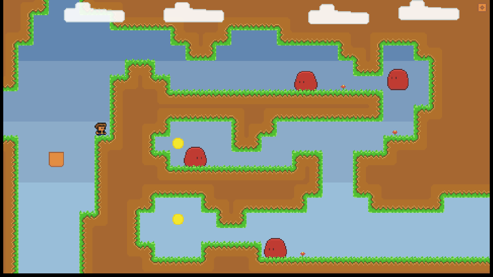

# Boy and Box

A game about a boy and his teleporting box written in Javascript. The rendering and audio is done using HTML-Canvas and the Web Audio API.

The game can be played on [Steam](https://store.steampowered.com/app/1232830/BoyandBox/), and was ported to desktop using [NW.js](https://nwjs.io/).

The code for the game can be found in [public/js](public/js).

